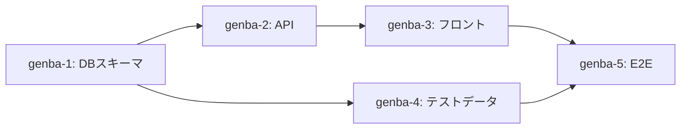

# Cascade Failure Module (CASCADE-001)

> **Module**: `cascade_failure` | **Default**: ON | **Scale**: Platoon+

タスク間の依存関係を明示し、依存先タスクの失敗時に依存元を自動ブロックする規約。

着想元: open-multi-agent の `TaskQueue`（DAGベースの依存管理 + 自動unblock + cascade failure）。
猫軍団ではコード内DAGではなく、ホワイトボード上のテキストDAGで管理する。

## Why

中隊以上で現場猫が並列作業する際、タスクAの成果物に依存するタスクBが存在する場合がある。
タスクAが失敗したのにタスクBが走り続けると、無駄な作業と手戻りが発生する。

「依存先が死んでるのに走り続けるのは、土台が崩れたビルの上階を塗装してるようなもんだ」

## タスク依存の宣言

仕事猫はタスク分解時に、ホワイトボードの `## タスク依存グラフ` セクションに依存関係を記述する。

### 記法

```markdown
## タスク依存グラフ

genba-1: DBスキーマ作成
genba-2: API実装 ← genba-1
genba-3: フロントエンド実装 ← genba-2
genba-4: テストデータ作成 ← genba-1
genba-5: E2Eテスト ← genba-3, genba-4
```

- `←` は「左辺は右辺に依存する」を意味する
- 複数依存はカンマ区切り: `← genba-1, genba-2`
- 依存なし（独立タスク）は `←` なしで記述
- 循環依存は禁止（仕事猫が検出した場合はタスク分割を見直す）

### Mermaid記法（オプショナル）

可視化が必要な場合、Mermaid DAGを併記してよい:



## Cascade Failure判定

### トリガー

仕事猫のポーリング（POLLING-001）で現場猫の完了報告を受信した際に判定する。

### 判定ルール

```
IF タスクX.status == FAIL:
  FOR EACH タスクY WHERE Y depends on X:
    Y.status = BLOCKED
    Y.reason = "CASCADE: 依存先 {X.task_id} が FAIL"
    仕事猫 → 該当現場猫に SendMessage: "タスク中断指示（依存先失敗）"
```

### 状態遷移

```
PENDING → IN_PROGRESS → COMPLETED
                      → FAIL → (依存元を CASCADE BLOCKED)
                      
BLOCKED → (依存先が修正完了後) → PENDING に戻す
```

### ダッシュボード表記

```markdown
| Task | Agent | Status | Depends On | Note |
|------|-------|--------|-----------|------|
| DBスキーマ | genba-1 | ✅ DONE | — | |
| API実装 | genba-2 | ❌ FAIL | genba-1 | 型定義エラー |
| フロント | genba-3 | 🚫 BLOCKED | genba-2 | CASCADE: API実装FAIL |
| テストデータ | genba-4 | ✅ DONE | genba-1 | |
| E2Eテスト | genba-5 | 🚫 BLOCKED | genba-3,4 | CASCADE: フロントBLOCKED |
```

## 仕事猫の対応手順

1. **即時通知**: BLOCKEDになった現場猫に中断指示を送る
2. **影響範囲の特定**: 依存グラフを辿り、連鎖的にBLOCKEDになるタスクを全て洗い出す
3. **修正判断**: 失敗タスクの修正を同じ現場猫に差し戻すか、別の現場猫に再割り当てするか判断
4. **BLOCKED解除**: 依存先が修正完了したら、BLOCKEDタスクをPENDINGに戻して再開指示
5. **ホワイトボード更新**: 状態変化をホワイトボードに反映

## 小隊での適用

小隊（仕事猫単独）でも、自分のタスクリスト内で依存順序を意識する。
cascade failureの機械的判定は不要だが、「この作業が失敗したら次に進まない」という判断は同じ。

## Integration Points

| Agent | Phase | Action |
|-------|-------|--------|
| shigoto-neko | Task decomposition (pre-dispatch) | ホワイトボードにタスク依存グラフを記述。循環依存チェック |
| shigoto-neko | Progress monitoring (polling) | FAIL検知時にcascade判定を実行。BLOCKEDタスクの現場猫に中断指示 |
| shigoto-neko | Post-fix | 依存先修正完了後、BLOCKEDタスクをPENDINGに戻して再開指示 |
| genba-neko | Pre-work | ホワイトボードの依存グラフで自タスクの依存先状態を確認 |
| genba-neko | On BLOCKED notification | 作業を中断し、仕事猫の再開指示を待つ |
